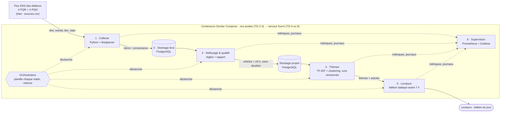

## Architecture

```mermaid
flowchart LR
    SRC["Flux RSS des éditeurs<br/>4 PQR + 4 PQN<br/>(liste : sources.csv)"]

    subgraph RUN["Conteneurs Docker Compose · nos postes (TD 2-3) → serveur fourni (TD 4 ou 6)"]
        ORCH{{"Orchestrateur<br/>planifie chaque matin, relance"}}
        C["1 · Collecte<br/>Python + feedparser"]
        B[("2 · Stockage brut<br/>PostgreSQL")]
        N["3 · Nettoyage & qualité<br/>règles + rapport"]
        P[("Stockage propre<br/>PostgreSQL")]
        T["4 · Thèmes<br/>TF-IDF + clustering, runs versionnés"]
        L["5 · Livraison<br/>édition statique avant 7 h"]
        S["6 · Supervision<br/>Prometheus + Grafana"]
    end

    PUB(["Lecteurs : édition du jour"])

    SRC -->|"titre, extrait, lien, date"| C
    C -->|"items + provenance"| B
    B --> N
    N -->|"articles < 24 h, sans doublon"| P
    P --> T
    T -->|"thèmes + articles"| L
    L --> PUB
    ORCH -.->|déclenche| C & N & T & L
    C & N & T & L -.->|métriques, journaux| S
```